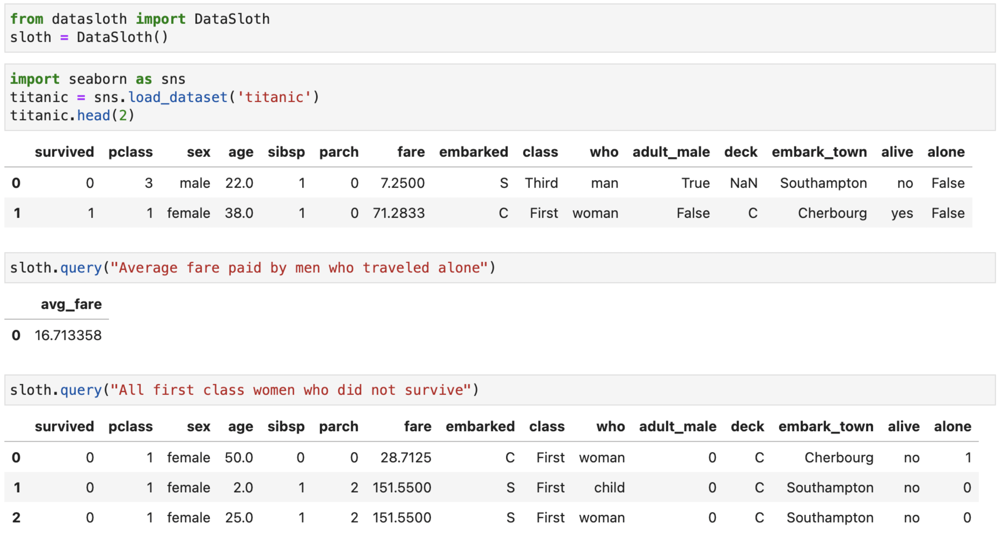

<p align="center">
  
</p>

# DataSloth
_Natural language Pandas queries powered by GPT-3_


<p align="center">
  
</p>


## Installation
`pip install datasloth`

## Usage

In order for DataSloth to work, you must have a working [OpenAI API key](https://beta.openai.com/account/api-keys) set in your environment variable, or provide it to the DataSloth object. For more info, refer to this [guide](https://help.openai.com/en/articles/5112595-best-practices-for-api-key-safety).

DataSloth automatically discovers all Pandas dataframes in your namespace (filtering out names starting with an underscode). Before you load any data, import DataSloth and create the `sloth`:

```python
from datasloth import DataSloth
sloth = DataSloth()
```

Next, load any data you want to use. Try naming your dataframes and columns in a meaningful way, as DataSloth uses these names to understand what the data is about.

Once your data is loaded, simply run

`sloth.query('...')`

to query the data.


## Improving results

To improve the results, you can set custom descriptions of your tables:

`df.sloth.description = 'Verbose description of the table'`

By default, table descriptions consist of information about each column in the table. You can include this default description in your custom one by adding a `{COLUMNS_SUMMARY}` placeholder. See the detailed example notebook in the examples folder for more information.

## Solving issues

A lot of times, if the returned data is not correct, or not fully formatted the way you want, it helps to rephrase the question or give specific pointers to how the final data should look like. To better understand where things might have gone wrong, use `show_query=True` and `show_prompt=True` flags in the `sloth.query()`, or run `sloth.show_last_prompt()` after the prompt has finished to print out this information (whithout rerunning the engine).
